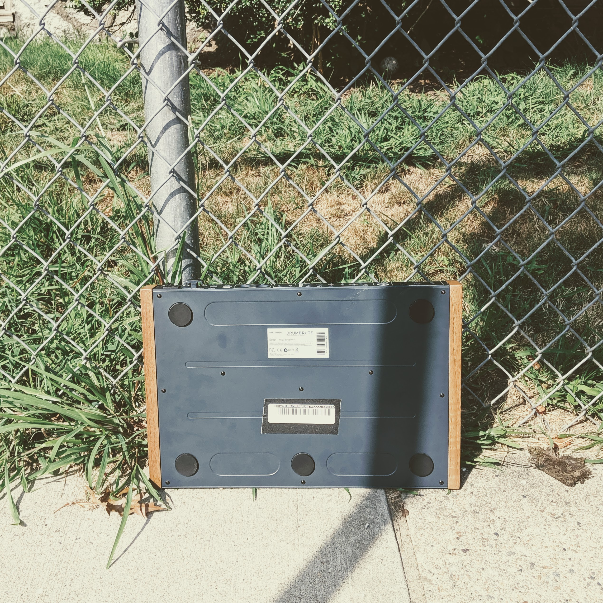

### Iain Standing

And Saint Attila raised the hand grenade up on high, saying, "O Lord, bless this thy hand grenade, that with it thou mayst blow thine enemies to tiny bits, in thy mercy." And the Lord did grin. And the people did feast upon the lambs and sloths, and carp and anchovies, and orangutans and breakfast cereals, and fruit-bats and large chu...

### Dani Sandoval

And Saint Attila raised the hand grenade up on high, saying, 'O Lord, bless this thy hand grenade, that with it thou mayst blow thine enemies to tiny bits, in thy mercy.' And the Lord did grin. And the people did feast upon the lambs and sloths, and carp and anchovies, and orangutans and breakfast cereals, and fruit-bats and large chu...

### ArtuBrute (the drum machine)

And the Lord spake, saying, "First shalt thou take out the Holy Pin. Then shalt thou count to three, no more, no less. Three shall be the number thou shalt count, and the number of the counting shall be three. Four shalt thou not count, neither count thou two, excepting that thou then proceed to three. Five is right out! Once the number three, being the third number, be reached, then lobbest thou thy Holy Hand Grenade of Antioch towards thy foe, who, being naughty in my sight, shall snuff it.

<iframe src="https://giphy.com/embed/YT7Z1bYpPhfi2ELpud" width="100%" height="100%" style="position:absolute" frameBorder="0" class="giphy-embed" allowFullScreen></iframe>
